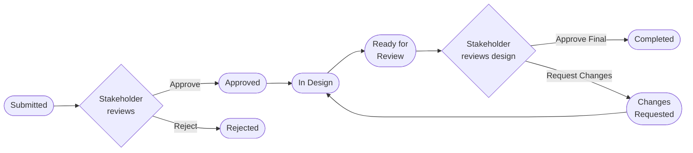

<div align="center">

# 🎨 Design Request Tool

**A lightweight internal hub for design requests — submit, manage, and approve, all in one place.**

Replaces the email / WhatsApp / spreadsheet shuffle: business teams submit structured design
requests, the design team tracks and fulfills them, and stakeholders approve requirements and
final designs — no login required.

[](https://react.dev)
[](https://vitejs.dev)
[](https://tailwindcss.com)
[](https://supabase.com)
[](https://react-hook-form.com)
[-lightgrey?style=flat-square)](#-security-model--no-auth-tradeoffs)

</div>

---

## 📑 Contents

- [Features](#-features)
- [Tech Stack](#-tech-stack)
- [Getting Started](#-getting-started)
- [How It Works](#-how-it-works)
- [Project Structure](#-project-structure)
- [Storage Layout](#-storage-layout)
- [Daily Approval Digest](#-daily-approval-digest-email)
- [Security Model / No-Auth Tradeoffs](#-security-model--no-auth-tradeoffs)
- [Known Limitations](#-known-limitations-by-design-for-v1)

---

## ✨ Features

| | |
|---|---|
| 📝 **Structured submission** | Multi-step form, multiple design requirements per batch, file uploads for references, brand assets, and content briefs |
| 📋 **Request management** | Searchable/filterable table, a detail drawer, status transitions, and delete — gated to the marketing team |
| ✅ **Stakeholder approvals** | Requirement approval → design approval → completed, each with comments, all reachable via a personal magic link (no login) |
| 📬 **Daily digest email** | One batched email per stakeholder per day — never one email per request |
| ⬇️ **Reliable downloads** | Final designs download as real files (forced `Content-Disposition`), in both Manage Requests and Approvals |
| 🔒 **Layered soft-gating** | `/requests` behind a team allowlist + password, `/approvals` behind a per-stakeholder token — see [Security Model](#-security-model--no-auth-tradeoffs) |

---

## 🧱 Tech Stack

| Layer | Choice |
|---|---|
| Frontend | React + JavaScript, built with Vite |
| Styling | Tailwind CSS |
| Routing | React Router |
| Forms & validation | React Hook Form + Zod |
| Backend | Supabase (Postgres + Storage), via `@supabase/supabase-js` |
| Email | Supabase Edge Function → Resend |
| Scheduling | `pg_cron` + `pg_net` |

---

## 🚀 Getting Started

### 1. Install dependencies

```bash
npm install
```

### 2. Create a Supabase project

Free tier is fine — [supabase.com](https://supabase.com).

### 3. Run the migrations

Open the Supabase **SQL Editor** and run each file in `supabase/migrations/`, **in order**:

| Migration | What it does |
|---|---|
| `0001_init.sql` | Core tables, the `DR-####` request-code sequence/trigger, `updated_at` triggers |
| `0002_rls.sql` | Row Level Security policies ([see Security Model](#-security-model--no-auth-tradeoffs)) |
| `0003_storage.sql` | Public `design-assets` storage bucket + upload policy |
| `0004_seed_stakeholders.sql` | Optional sample stakeholders so the app is usable immediately |
| `0005_allow_request_delete.sql` | Lets the design team permanently delete a request |
| `0006_stakeholder_tokens.sql` | Per-stakeholder magic-link tokens for Approvals |
| `0007_daily_digest_cron.sql` | Schedules the daily digest — **read [Daily Approval Digest](#-daily-approval-digest-email) first**, it needs a secret created manually before this one |
| `0008_stakeholders_update.sql` | Lets a stakeholder be deactivated (`active = false`) |
| `0009_requester_name_optional.sql` | Drops `NOT NULL` on `request_batches.requester_name` (field no longer collected) |

> 💡 With the Supabase CLI linked to the project, `supabase db push` applies all of these for
> you — except `0007`, which still needs the manual Vault secret step first.

### 4. Configure environment variables

```bash
cp .env.example .env
```

Fill in `.env` with your project's values (Supabase dashboard → **Project Settings → API**):

```env
VITE_SUPABASE_URL=https://xxxxx.supabase.co
VITE_SUPABASE_ANON_KEY=eyJ...
```

### 5. Run the app

```bash
npm run dev
```

Open the printed local URL — `/` redirects to `/submit`.

---

## 🔄 How It Works



1. **Anyone** submits a request at `/submit` — one or more design requirements in a single batch. Fully open, no restriction.
2. It appears in **Manage Requests → All Requests** (`/requests`) with status *Awaiting Approval* — also open to everyone.
3. Once a day, every stakeholder with at least one pending item gets **one** email listing all of them, with an **Approve Now** button linking to `/approvals?token=...`, scoped to just that stakeholder. See [Daily Approval Digest](#-daily-approval-digest-email) and [Security Model](#-security-model--no-auth-tradeoffs) for how that works without a login.
4. The stakeholder approves the requirement → status **Approved**.
5. The design team moves it to **In Design**.
6. The design team uploads the final design and marks it **Ready for Review**.
7. The stakeholder sees it in their next digest, under Approvals → Design Approvals, and either:
   - ✅ **Approves Final** → status **Completed**, or
   - 🔁 **Requests Changes** → status **Changes Requested** → back to **In Design**, repeating from step 6 with a new version.

---

## 📁 Project Structure

```text
src/
  components/
    layout/      AppHeader, PageContainer, ManageRequestsTabs, BackgroundShapes
    form/        Submit-request steps — requester details, requirement form/list,
                 file uploader, review cards, success screen
    requests/    All Requests table/filters, detail drawer, design-team status panel,
                 TeamLoginGate (the /requests allowlist+password gate)
    approvals/   Requirement & design approval cards
    ui/          Button, FormField, SelectField, StatusBadge, EmptyState,
                 LoadingState, ErrorState, ConfirmationModal, Stepper
  pages/         SubmitRequestPage, AllRequestsPage, ApprovalsPage
  lib/           supabase client, constants, zod validations, request-code
                 helpers, upload helpers, api.js (all Supabase queries/mutations),
                 teamAccess.js (the /requests allowlist + shared password)
  hooks/         useStakeholders, useDraftForm (session-persisted submit form),
                 useStakeholderAccess (token-gated Approvals access),
                 useTeamAccess (allowlist+password gate for All Requests)
supabase/
  migrations/    SQL migrations described above
  functions/
    send-approval-digest/   Edge Function — the once-daily batched approval email
```

> All data access goes through `src/lib/api.js` — there's no other place in the app that talks
> to Supabase directly, keeping the schema and UI decoupled.

---

## 🗂️ Storage Layout

Files upload to one public bucket, `design-assets`, organized per request:

```text
DR-1021/
  references/     files attached under "References" on the request form
  brand-assets/    co-branding logo/brand files
  final-designs/   design-team output, one entry per version uploaded
```

> ⚠️ **Not atomic.** Reference/brand-asset files upload once the request itself is created (so
> its `DR-####` code exists to name the folder) — see `submitDesignRequestBatch` in
> `src/lib/api.js`. This isn't wrapped in a database transaction (the anon REST client can't
> span one across multiple tables + storage calls), so a submission that fails partway through
> can leave an incomplete batch. Acceptable for an internal V1 tool; moving submission into a
> Postgres RPC or Edge Function would close this gap if it becomes a problem.

---

## 📧 Daily Approval Digest (email)

Requirement and design approvals aren't emailed one at a time. Once a day, a Supabase Edge
Function collects every pending approval, groups it by stakeholder, and sends **one** email per
stakeholder (not per request) with an **Approve Now** button that deep-links into their scoped
`/approvals` view.

### How the link works without a login

Each stakeholder row has an `access_token` (added in `0006_stakeholder_tokens.sql`). The email's
button links to `/approvals?token=<their token>`. Opening that link resolves the token — via the
`resolve_stakeholder_by_token` Postgres function, the *only* way the token can ever be read back
(a plain `select * from stakeholders` cannot see it; see the migration for why) — and scopes the
page to that person's approvals. Whoever holds the link is trusted as that stakeholder; there's
no second factor. That's a deliberate product decision (the email only ever goes to that
person's real inbox), not an oversight — see [Security Model](#-security-model--no-auth-tradeoffs)
for the actual exposure this leaves.

If a requester picks "Other" and types a stakeholder's name/email at submission time, that person
is automatically turned into a real stakeholder row too (see `findOrCreateStakeholder` in
`src/lib/api.js`), so they get a token and start receiving the digest exactly like a pre-listed
stakeholder.

### Deploying it

**You'll need:**
- The [Supabase CLI](https://supabase.com/docs/guides/cli), logged in and linked to this project (`supabase link`)
- A [Resend](https://resend.com) account + API key, with a sending domain/address verified there

**Steps:**

1. **Deploy the function** — `--no-verify-jwt` because `pg_cron` calls it over plain HTTP, not
   with a user JWT (the function checks its own shared secret instead, see below):

   ```bash
   supabase functions deploy send-approval-digest --no-verify-jwt
   ```

2. **Set its secrets** (`SUPABASE_URL` / `SUPABASE_SERVICE_ROLE_KEY` are injected automatically —
   don't set those):

   ```bash
   supabase secrets set RESEND_API_KEY=re_xxxxx
   supabase secrets set DIGEST_FROM_EMAIL="Design Request Tool <notifications@yourdomain.com>"
   supabase secrets set SITE_URL=https://your-deployed-app-url.com
   supabase secrets set DIGEST_INVOKE_SECRET=<any long random string>
   ```

3. **Store that same invoke secret in Supabase Vault** (SQL Editor — do this once; do *not* put
   the real value in a committed file):

   ```sql
   select vault.create_secret('<the exact same random string from step 2>', 'digest_invoke_secret');
   ```

4. **Run `0007_daily_digest_cron.sql`** — schedules a 9:00 UTC daily job that calls the function
   using the Vault secret from step 3. Adjust the cron expression in that file first if 9:00 UTC
   doesn't suit your stakeholders' timezone.

5. **Test it anytime**, without waiting for the schedule:

   ```bash
   curl -X POST https://your-project-ref.supabase.co/functions/v1/send-approval-digest \
     -H "x-digest-secret: <your DIGEST_INVOKE_SECRET>"
   ```

   Returns `{"stakeholdersNotified": N, "results": [...]}`.

### ⚠️ Known limitation

Any `design_requests` rows created **before** `0006_stakeholder_tokens.sql` was applied, where
the requester picked "Other" as the stakeholder, have no linked stakeholder row (the old flow
only stored a free-text name/email). Those won't appear in anyone's digest or scoped Approvals
view. New submissions don't have this problem — every "Other" pick now upserts a real
stakeholder row. If you have such rows and need them fixed up, match them to (or create) a
stakeholder by email and backfill `request_batches.stakeholder_id` manually.

---

## 🔐 Security Model / No-Auth Tradeoffs

**There is deliberately no login in V1.** Every request from the browser uses the public Supabase
`anon` key, so Row Level Security (RLS) — not application auth — decides what it can do. RLS is
**enabled on every table** (never disabled globally), with narrow policies (see `0002_rls.sql`)
that only allow the operations the app actually performs:

| Table | Select | Insert | Update | Delete | Notes |
|---|:---:|:---:|:---:|:---:|---|
| `stakeholders` | ✅ | ✅ | ✅ | ❌ | Select excludes `access_token` (column-level grant); insert lets "Other" upsert a stakeholder; update is for deactivating (`active = false`) rather than deleting |
| `request_batches` | ✅ | ✅ | ❌ | ❌ | Created once at submission, never touched again |
| `design_requests` | ✅ | ✅ | ✅ | ✅ | Delete added in `0005` — the design team can remove a request entirely |
| `attachments` | ✅ | ✅ | ❌ | ✅ | Delete only cascades from a request delete; a new version is a new row |
| `approvals` | ✅ | ✅ | ✅ | ✅ | Delete cascades the same way as attachments |

The `design-assets` storage bucket is public, with an insert policy scoped to that bucket only;
reads are served via Supabase's public-bucket CDN path.

> **What this means in practice:** anyone with the published anon key (not secret, but visible in
> this app's bundled JS) can call these same operations directly — e.g. approve any request, or
> move any request's status — without going through the UI, **as long as they can reach the right
> row**. That's an acceptable trade-off for an internal tool used by a small trusted team, but it
> is **not** a substitute for real authorization.

### Two screens have an extra gate on top of this

Everything else (`/submit`) stays fully open.

- **`/requests` (All Requests)** — restricted to the marketing team: a fixed allowlist of 5
  emails plus one shared password (see `src/lib/teamAccess.js`). Whoever logs in stays logged in
  (in `localStorage`) until they hit "Log out". This is a soft barrier, nothing more — the email
  list and password both ship in the JS bundle, the check runs entirely in React, and the anon
  key underneath still has full read/write on every table regardless of whether someone's
  "logged in". It stops a random visitor from stumbling into the request-management UI; it does
  not stop someone who reads the bundle from bypassing it entirely.
- **`/approvals`** — only shows content to someone holding a stakeholder's personal
  `?token=...` link (delivered privately by the daily digest email). This is *link possession*,
  not authentication — there's no password, and no check that the person clicking the link is
  really that stakeholder.

Both checks stop casual/accidental access (you can't just browse to either page and see
everything, unlike a truly open no-auth screen), but neither stops a determined user with the
anon key from bypassing the UI and calling the same REST endpoints directly. Real authorization
still requires Supabase Auth.

### Where to introduce auth later

1. Add a `user_id`/`role` concept (e.g. a `profiles` table keyed by `auth.uid()`).
2. Tighten the `design_requests`/`approvals` update policies to require `auth.uid()` to match the
   assigned stakeholder or a "design team" role, instead of the current `using (true)` — this is
   where the token-based `/approvals` gating should move from "checked in React" to "enforced by
   Postgres".
3. Consider moving multi-step writes (submission, approvals) into Postgres functions
   (`security definer`) or Edge Functions so the anon key is never trusted with raw table writes
   at all.

None of this is needed for V1 to work correctly — it's the explicit boundary of what "no-auth"
means here, so a future contributor knows exactly what's open and why.

---

## ⚠️ Known Limitations (by design, for V1)

- No authentication, roles, or permissions — `/requests` has an allowlist+password gate and
  `/approvals` has link-based gating (see [Security Model](#-security-model--no-auth-tradeoffs)); `/submit` is fully open.
- Submission isn't atomic across tables/storage (see [Storage Layout](#-storage-layout)).
- No kanban, task assignment, or analytics — out of scope per the V1 brief.
- Design requests created before `0006_stakeholder_tokens.sql`, with an "Other" stakeholder,
  aren't linked to a stakeholder row and won't appear in the digest/scoped Approvals view (see
  [Daily Approval Digest](#-daily-approval-digest-email)).
